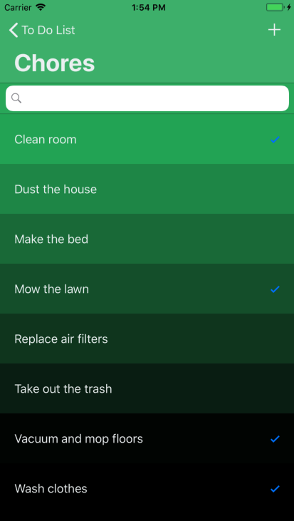

# TodoList
Todo List Application developed using Swift 4 in Xcode 9.4.1. Data persistance achieved using the Realm Database 
covering each operation of CRUD. Implemented gradient and contrasting UIColor customizations utilizing the Chameleon 
Framework to provide the user with an elegant user interface.

 

<h1>Future Enhancements:</h1>
<ul>
  <li> Thorough testing for deficiencies </li>
  <li> Add alerts in specified locations for any possible errors </li>
  <li> Add Settings option to individually customize user experience </li>
</ul>

 

<h1>Latest Adjustments:</h1>
<ul>
  <li>  </li>
  <li>  </li>
</ul>

 

  
  
  
  

