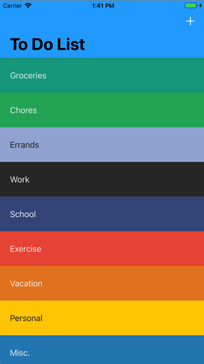
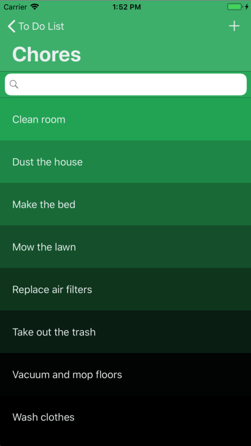
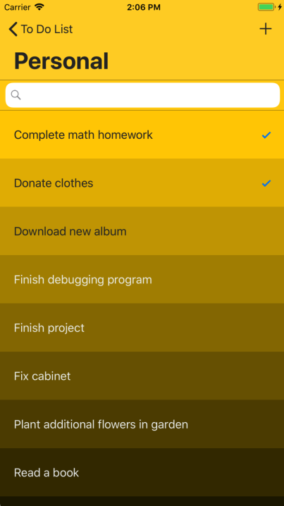

# TodoList
Todo List Application developed using Swift 4 in Xcode 9.4.1. Data persistance achieved using the Realm Database 
covering each operation of CRUD. Implemented gradient and contrasting UIColor customizations utilizing the Chameleon 
Framework to provide the user with an elegant user interface.

</br>

Completed as part of an assignment for a course using database operations (CRUD) with the Realm Database as well as front-end UI enhancements with the assistance of the Chameleon Framework.

<br>


<h1>Future Enhancements:</h1>
<ul>
  <li> Thorough testing for deficiencies </li>
  <li> Add alerts in specified locations for any possible errors </li>
  <li> Add Settings option to individually customize user experience </li>
  <li> Implement color tag customizations for categories & items </li>
  <li> Add option within settings to adjust sorting method (Alphabetical, Date Created... etc) </li>
  <li> Include optional quantity attribute for each item </li>
</ul>

</br>

<h1>Latest Adjustments:</h1>
<ul>
  <li> 07/10/2018 - Added UIColor customizations included in Chameleon Framework </li>
  <li> 07/09/2018 - Converted data model to use the Realm Database for robust data persistence capabilities </li>
  <li> 07/07/2018 - Restructured to replace UserDefaults with CoreData data persistence functionality </li>
  <li> 07/02/2018 - Initial data model created using data persistence with UserDefaults </li>
</ul>


</br>

<h2> Homescreen - Categories </h2>
<p>
  
  <ul>
    <li> Current cell color selection based on random UIColor chosen and persisted as cell attribute  </li>
    <li> Cells can be deleted using SwipeCellKit functionality by swiping left with a clickable delete icon appearing </li>
    <li> Add button allows user to create custom categories sorted from oldest to newest </li>
  </ul>
</p>

</br>
</br>
</br>
</br>
</br>
</br>
</br>
</br>
</br>
</br>
</br>

<h2> Todo Items List - Functionality & Design </h2>
<p>
  
  <ul>
    <li> Add item functionality using add button which inserts item into list sorted alphabetically </li>
    <li> Searching items made simple with a responsive search bar component </li>
    <li> Individual cells carry a checked/unchecked status that updates UI if item is completed </li>
    <li> Cell background color carried over from preselected UIColor and serves as the base for gradient UI customization </li>
    <li> Each additional cell added to tableView is used to calculate the percentage at which to darken cell for gradient effect </li>
      
  </ul>
    
```swift
if let color = UIColor(hexString: selectedCategory!.bgColor)?.darken(byPercentage: CGFloat(indexPath.row) / CGFloat(todoItems!.count)) {
  cell.backgroundColor = color
  cell.textLabel?.textColor = ContrastColorOf(color, returnFlat: true)
}
```
    
</p>

</br>
</br>
</br>
</br>

<h2> Todo Items List - Contrast Design </h2>
<p>
  
  <ul>
    <li> Contrasting font and gradient background colors function for each individual cell </li>
    <li> Chameleon Framework feature allows automatic detection of darker background colors, changing font to white when necessary </li>
    <li> Reference to methods listed below </li>
    https://github.com/ViccAlexander/Chameleon#contrasting-colors
  </ul>
</p>


</br>
